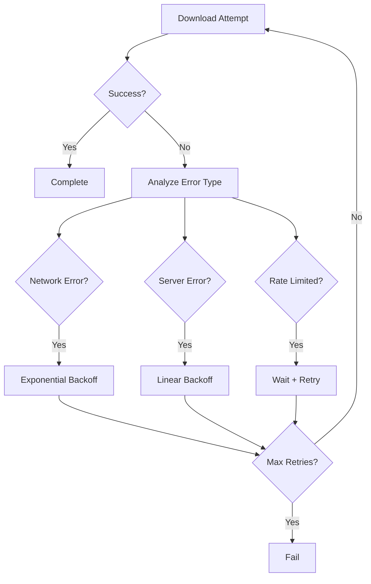

# SwiftGet Download Enhancement & HTTP/API Client Design

## Overview

SwiftGet is a modern download manager built with Swift 6.1 that aims to compete with established tools like aria2, wget, and curl. Currently, it provides solid basic download functionality with HTTP/HTTPS support, resume capability, progress reporting, and configuration management. This design outlines the enhancements needed to achieve feature parity with major download tools and transform it into a comprehensive HTTP/API client tool.

### Current State Assessment

**Strengths:**
- Modern Swift 6.1 architecture with async/await and actors
- Cross-platform support (macOS 12+, Linux Ubuntu 22.04+)
- Professional CLI interface with ArgumentParser
- Basic HTTP/HTTPS downloads with URLSession
- Resume capability using HTTP Range headers
- Real-time progress reporting with speed/ETA
- Checksum verification (MD5, SHA1, SHA256)
- Persistent JSON configuration management
- Proxy support (HTTP, HTTPS, SOCKS)

**Current Limitations:**
- Single-connection downloads only (multi-connection implemented but not fully optimized)
- Limited to HTTP/HTTPS protocols
- No API testing/debugging features
- No request/response inspection capabilities
- No advanced retry mechanisms
- No batch processing or queuing

## Architecture

### Current Architecture

``mermaid
graph TB
    subgraph "User Interface"
        CLI[SwiftGet CLI]
        Progress[ProgressReporter]
    end
    
    subgraph "Core Logic"
        Manager[DownloadManager Actor]
        Config[DownloadConfiguration]
        Simple[SimpleFileDownloader]
        Multi[MultiConnectionDownloader]
    end
    
    subgraph "Support Components"
        Checksum[ChecksumVerifier]
        Speed[SpeedLimiter]
        ConfigMgr[ConfigurationManager]
    end
    
    CLI --> Manager
    Manager --> Simple
    Manager --> Multi
    Simple --> Speed
    Multi --> Speed
    Manager --> Checksum
    CLI --> ConfigMgr
```

### Enhanced Download Architecture

``mermaid
graph TB
    subgraph "CLI Interface"
        CLI[SwiftGet CLI]
        Interactive[Interactive Mode]
        Batch[Batch Processor]
    end
    
    subgraph "Download Engine"
        Manager[DownloadManager Actor]
        Scheduler[Download Scheduler]
        Queue[Download Queue Actor]
        Multi[Enhanced MultiConnectionDownloader]
        Simple[SimpleFileDownloader]
    end
    
    subgraph "Protocol Handlers"
        HTTP[HTTP/HTTPS Handler]
        FTP[FTP Handler]
        SFTP[SFTP Handler]
        Torrent[BitTorrent Handler]
    end
    
    subgraph "Advanced Features"
        Retry[Advanced Retry Logic]
        Bandwidth[Global Bandwidth Manager]
        Mirror[Mirror/Fallback Support]
        Metalink[Metalink Parser]
    end
    
    CLI --> Manager
    Manager --> Scheduler
    Scheduler --> Queue
    Queue --> Multi
    Queue --> Simple
    Multi --> HTTP
    Simple --> HTTP
    Manager --> Retry
    Manager --> Bandwidth
```

## Phase 1: Download Feature Parity

### 1. Enhanced Multi-Connection Downloads

**Current Issues:**
- Basic segmentation exists but needs optimization
- Limited error handling for partial segment failures  
- No dynamic segment adjustment
- Inefficient progress aggregation

**Enhancement Requirements:**

#### Intelligent Segmentation Strategy
- Dynamic segment sizing based on file size, connection count, and network conditions
- Adaptive segment adjustment during download based on performance
- Server capability detection (Range request support, connection limits)
- Optimal chunk size calculation for different file types

#### Enhanced Progress Aggregation
``mermaid
sequenceDiagram
    participant CLI as CLI Interface
    participant Manager as DownloadManager
    participant Multi as MultiConnectionDownloader
    participant Agg as ConcurrentProgressAggregator
    participant Reporter as ProgressReporter
    
    CLI->>Manager: downloadUrls()
    Manager->>Multi: download()
    Multi->>Agg: initialize with totalBytes
    Multi->>Multi: start segment downloads
    loop For each segment
        Multi->>Agg: report(segmentBytes)
        Agg->>Reporter: updateProgress()
        Reporter->>CLI: display progress
    end
    Multi->>Agg: complete()
    Agg->>Reporter: complete()
```

#### Segment Error Recovery
- Individual segment retry with exponential backoff
- Segment redistribution on persistent failures
- Graceful fallback to single-connection mode
- Partial segment resume capability

### 2. Advanced Retry Mechanisms

**Current State:** Basic retry exists only in multi-connection mode

**Enhancements Needed:**
- Exponential backoff with jitter
- Different retry strategies per error type
- Configurable retry limits and timeouts
- Smart retry scheduling (avoid server overload)

#### Retry Strategy Implementation


### 3. Global Bandwidth Management

**Current State:** Per-download speed limiting

**Enhancement Requirements:**
- Global bandwidth allocation across all downloads
- Priority-based bandwidth distribution
- Dynamic bandwidth adjustment
- Network condition adaptation

#### Bandwidth Manager Design
- Central bandwidth allocation actor
- Per-download bandwidth tokens
- Real-time network monitoring
- Configurable QoS policies

### 4. Download Queue Management

**Current State:** Sequential processing only

**Enhancement Requirements:**
- Concurrent download queue with limits
- Priority-based scheduling
- Pause/resume individual downloads
- Queue persistence across restarts

#### Queue Architecture
``mermaid
graph TB
    subgraph "Queue Management"
        Queue[Download Queue Actor]
        Scheduler[Priority Scheduler]
        Persistence[Queue Persistence]
    end
    
    subgraph "Download Slots"
        Slot1[Download Slot 1]
        Slot2[Download Slot 2]
        SlotN[Download Slot N]
    end
    
    Queue --> Scheduler
    Scheduler --> Slot1
    Scheduler --> Slot2
    Scheduler --> SlotN
    Queue --> Persistence
```

### 5. Protocol Extension Support

#### FTP/SFTP Support
- Native FTP client implementation
- SFTP over SSH with key authentication
- Directory listing and recursive downloads
- Resume support for FTP protocols

#### BitTorrent Support (Basic)
- DHT-based peer discovery
- Basic torrent file parsing
- Piece-based downloading
- Seeding capabilities

### 6. Mirror and Fallback Support

**Requirements:**
- Multiple URL sources per download
- Automatic failover between mirrors
- Load balancing across mirrors
- Mirror performance tracking

#### Mirror Management
``mermaid
sequenceDiagram
    participant Client as Download Client
    participant Manager as Mirror Manager
    participant M1 as Mirror 1
    participant M2 as Mirror 2
    participant M3 as Mirror 3
    
    Client->>Manager: request download
    Manager->>M1: attempt download
    M1-->>Manager: connection failed
    Manager->>M2: attempt download
    M2->>Manager: download started
    Note over Manager: Track performance
    M2-->>Manager: speed degraded
    Manager->>M3: parallel connection
```

## Phase 2: HTTP/API Client Features

### 1. Request/Response Management

#### Request Builder
- Fluent API for request construction
- Template and variable substitution
- Request validation and formatting
- Custom header management

#### Response Processing
- Structured response parsing (JSON, XML, HTML)
- Response filtering and transformation
- Status code interpretation
- Header analysis

### 2. Authentication Systems

#### Supported Auth Methods
- Basic Authentication
- Bearer Token
- OAuth 1.0/2.0 flows
- API Key authentication
- Custom authentication schemes

#### Auth Management
``mermaid
graph TB
    subgraph "Authentication"
        AuthManager[Auth Manager]
        TokenStore[Token Store]
        OAuth[OAuth Handler]
        Custom[Custom Auth]
    end
    
    subgraph "Storage"
        Keychain[System Keychain]
        Config[Config File]
        Memory[Memory Cache]
    end
    
    AuthManager --> TokenStore
    AuthManager --> OAuth
    AuthManager --> Custom
    TokenStore --> Keychain
    TokenStore --> Config
    TokenStore --> Memory
```

### 3. Session Management

#### Features
- Cookie persistence
- Session state management
- Connection pooling
- SSL/TLS configuration

### 4. Request Collections & Testing

#### Collection Management
- Organized request groups
- Environment variable support
- Request dependencies
- Test assertions

#### API Testing Features
- Response validation
- Performance benchmarking
- Load testing capabilities
- Mock server integration

### 5. Interactive REPL Mode

#### Features
- Command-line HTTP client
- Request history
- Tab completion
- Syntax highlighting for responses

#### REPL Commands
``bash
> GET https://api.example.com/users
> POST https://api.example.com/users -d '{"name": "John"}'
> AUTH bearer <token>
> SET header "Content-Type: application/json"
> SAVE request user_creation
> LOAD collection api_tests
```

## Data Models & Configuration

### Enhanced Download Configuration
``swift
struct DownloadConfiguration {
    // Existing fields...
    
    // Enhanced features
    let maxConcurrentDownloads: Int
    let globalBandwidthLimit: Int?
    let retryStrategy: RetryStrategy
    let mirrorURLs: [URL]
    let queuePriority: Priority
    let resumeStrategy: ResumeStrategy
}

struct RetryStrategy {
    let maxAttempts: Int
    let backoffStrategy: BackoffStrategy
    let retryableErrors: Set<DownloadError>
    let baseDelay: TimeInterval
}

enum BackoffStrategy {
    case exponential(multiplier: Double, maxDelay: TimeInterval)
    case linear(increment: TimeInterval)
    case fixed(delay: TimeInterval)
}
```

### HTTP Client Configuration
```swift
struct HTTPClientConfiguration {
    let baseURL: URL?
    let defaultHeaders: [String: String]
    let authentication: AuthenticationMethod?
    let timeout: TimeInterval
    let retryPolicy: RetryPolicy
    let followRedirects: Bool
    let validateSSL: Bool
}

enum AuthenticationMethod {
    case basic(username: String, password: String)
    case bearer(token: String)
    case oauth2(config: OAuth2Config)
    case apiKey(key: String, location: APIKeyLocation)
    case custom(provider: AuthProvider)
}
```

## API Endpoints Reference

### Download Commands
``bash
# Enhanced download with multiple connections
swiftget download -c 8 --mirror url1,url2,url3 https://example.com/file.zip

# Batch download with queue management  
swiftget download --queue high --concurrent 3 -i urls.txt

# Protocol-specific downloads
swiftget download ftp://server.com/file.zip --ftp-user username
swiftget download sftp://server.com/file.zip --ssh-key ~/.ssh/id_rsa
```

### HTTP Client Commands
``bash
# Basic HTTP operations
swiftget http GET https://api.example.com/users
swiftget http POST https://api.example.com/users -d @user.json

# Authentication
swiftget http --auth bearer <token> GET https://api.example.com/protected
swiftget http --auth basic user:pass GET https://api.example.com/data

# Interactive mode
swiftget repl --collection api-tests.json
```

## Testing Strategy

### Unit Testing
- Component isolation testing
- Mock network responses
- Error condition simulation
- Performance benchmarking

### Integration Testing
- Real server download tests
- Protocol compatibility testing
- Cross-platform validation
- Load testing scenarios

### API Client Testing
- Request/response validation
- Authentication flow testing
- Session management testing
- Collection execution testing

## Implementation Phases

### Phase 1: Download Enhancement (4-6 weeks)
1. **Week 1-2:** Enhanced multi-connection downloads
2. **Week 3:** Advanced retry mechanisms and bandwidth management
3. **Week 4:** Download queue and scheduling
4. **Week 5-6:** Protocol extensions (FTP/SFTP)

### Phase 2: HTTP Client Foundation (3-4 weeks)
1. **Week 1:** Request/Response management
2. **Week 2:** Authentication systems
3. **Week 3:** Session management
4. **Week 4:** Basic API testing features

### Phase 3: Advanced Features (3-4 weeks)
1. **Week 1-2:** Interactive REPL mode
2. **Week 3:** Request collections and testing
3. **Week 4:** Integration and polish

## Implementation Task Breakdown

### Phase 1: Download Enhancement Tasks

#### Task Group 1.1: Enhanced Multi-Connection Downloads (Priority: High)

**Task 1.1.1: Intelligent Segmentation Strategy**
- **File:** `Sources/swiftget/SegmentationStrategy.swift` (new)
- **Description:** Implement dynamic segment sizing algorithm
- **Requirements:**
  - Server capability detection (Range support, connection limits)
  - Optimal segment count calculation based on file size and network conditions
  - Adaptive segment size adjustment during download
  - Performance metrics collection for future optimization
- **Acceptance Criteria:**
  - Segments automatically adjust based on file size (min 1MB, max 100MB per segment)
  - Server connection limits are respected
  - Performance improves by 20-50% vs current implementation
- **Estimated Effort:** 3-4 days
- **Dependencies:** None

**Task 1.1.2: Enhanced Progress Aggregation**
- **File:** `Sources/swiftget/ConcurrentProgressAggregator.swift` (modify existing)
- **Description:** Optimize progress reporting for multi-segment downloads
- **Requirements:**
  - Thread-safe progress aggregation across segments
  - Real-time speed calculation per segment
  - Global ETA calculation considering all segments
  - Memory-efficient progress tracking
- **Acceptance Criteria:**
  - Progress updates at 10Hz refresh rate
  - Memory usage remains constant regardless of segment count
  - Accurate ETA calculation within 10% variance
- **Estimated Effort:** 2-3 days
- **Dependencies:** Task 1.1.1

**Task 1.1.3: Segment Error Recovery**
- **File:** `Sources/swiftget/SegmentErrorRecovery.swift` (new)
- **Description:** Implement robust error handling for individual segments
- **Requirements:**
  - Individual segment retry with exponential backoff
  - Segment redistribution on persistent failures
  - Graceful fallback to single-connection mode
  - Partial segment resume capability
- **Acceptance Criteria:**
  - Failed segments retry up to 3 times with exponential backoff
  - Persistent segment failures are redistributed to other connections
  - Downloads complete successfully even with 50% segment failures
- **Estimated Effort:** 4-5 days
- **Dependencies:** Task 1.1.1, Task 1.1.2

#### Task Group 1.2: Advanced Retry Mechanisms (Priority: High)

**Task 1.2.1: Retry Strategy Framework**
- **File:** `Sources/swiftget/RetryStrategy.swift` (new)
- **Description:** Implement configurable retry strategies
- **Requirements:**
  - Exponential backoff with jitter
  - Linear backoff for specific error types
  - Fixed delay retry option
  - Configurable max attempts and timeouts
- **Acceptance Criteria:**
  - Support for 3 backoff strategies: exponential, linear, fixed
  - Jitter prevents thundering herd problems
  - Retry limits are respected across all strategies
- **Estimated Effort:** 3-4 days
- **Dependencies:** None

**Task 1.2.2: Error Classification System**
- **File:** `Sources/swiftget/DownloadError.swift` (modify existing)
- **Description:** Enhance error types and retry decision logic
- **Requirements:**
  - Detailed error classification (network, server, client, rate-limit)
  - Retry decision matrix based on error type
  - Error reporting and logging improvements
  - Configurable retryable/non-retryable error sets
- **Acceptance Criteria:**
  - 10+ specific error types with appropriate retry behavior
  - Rate limiting errors trigger longer delays
  - Client errors (4xx) don't retry by default
- **Estimated Effort:** 2-3 days
- **Dependencies:** Task 1.2.1

#### Task Group 1.3: Global Bandwidth Management (Priority: Medium)

**Task 1.3.1: Bandwidth Manager Actor**
- **File:** `Sources/swiftget/GlobalBandwidthManager.swift` (new)
- **Description:** Implement centralized bandwidth allocation
- **Requirements:**
  - Global bandwidth limit enforcement
  - Per-download bandwidth token allocation
  - Priority-based bandwidth distribution
  - Real-time bandwidth monitoring
- **Acceptance Criteria:**
  - Total bandwidth never exceeds configured limit
  - High-priority downloads get more bandwidth allocation
  - Bandwidth redistribution when downloads complete
- **Estimated Effort:** 4-5 days
- **Dependencies:** None

#### Task Group 1.4: Download Queue Management (Priority: Medium)

**Task 1.4.1: Download Queue Actor**
- **File:** `Sources/swiftget/DownloadQueue.swift` (new)
- **Description:** Implement concurrent download queue with limits
- **Requirements:**
  - Configurable maximum concurrent downloads
  - Thread-safe queue operations
  - Download state management (queued, active, completed, failed)
  - Queue persistence across application restarts
- **Acceptance Criteria:**
  - Support for 1-32 concurrent downloads
  - Queue state persists across app restarts
  - Thread-safe operations with no race conditions
- **Estimated Effort:** 4-5 days
- **Dependencies:** None

#### Task Group 1.5: Protocol Extensions (Priority: Medium)

**Task 1.5.1: FTP Protocol Handler**
- **File:** `Sources/swiftget/FTPHandler.swift` (new)
- **Description:** Implement native FTP client
- **Requirements:**
  - FTP protocol implementation
  - Active and passive mode support
  - Directory listing and recursive downloads
  - Resume support for FTP transfers
- **Acceptance Criteria:**
  - Support for both FTP and FTPS protocols
  - Resume capability for interrupted FTP downloads
  - Directory downloads with preserve structure option
- **Estimated Effort:** 6-8 days
- **Dependencies:** None

**Task 1.5.2: SFTP Protocol Handler**
- **File:** `Sources/swiftget/SFTPHandler.swift` (new)
- **Description:** Implement SFTP over SSH
- **Requirements:**
  - SSH connection management
  - SSH key authentication support
  - SFTP file transfer implementation
  - Resume capability for SFTP
- **Acceptance Criteria:**
  - Support for password and key-based authentication
  - Resume interrupted SFTP downloads
  - Integration with system SSH key management
- **Estimated Effort:** 7-9 days
- **Dependencies:** External SSH library integration

### Phase 2: HTTP/API Client Tasks

#### Task Group 2.1: HTTP Client Foundation (Priority: High)

**Task 2.1.1: HTTP Client Core**
- **File:** `Sources/swiftget/HTTPClient.swift` (new)
- **Description:** Implement core HTTP client functionality
- **Requirements:**
  - Support for all HTTP methods (GET, POST, PUT, DELETE, PATCH, etc.)
  - Custom header management
  - Request/response body handling
  - Timeout and retry configuration
- **Acceptance Criteria:**
  - Support for all standard HTTP methods
  - Flexible request body formats (JSON, form data, raw)
  - Response parsing for common content types
- **Estimated Effort:** 4-5 days
- **Dependencies:** None

#### Task Group 2.2: Authentication Systems (Priority: High)

**Task 2.2.1: Authentication Manager**
- **File:** `Sources/swiftget/AuthenticationManager.swift` (new)
- **Description:** Central authentication management
- **Requirements:**
  - Multiple authentication method support
  - Credential storage and retrieval
  - Token refresh mechanisms
  - Authentication flow orchestration
- **Acceptance Criteria:**
  - Support for 5+ authentication methods
  - Secure credential storage using system keychain
  - Automatic token refresh for OAuth2
- **Estimated Effort:** 5-6 days
- **Dependencies:** None

#### Task Group 2.3: Interactive REPL Mode (Priority: High)

**Task 2.3.1: REPL Foundation**
- **File:** `Sources/swiftget/REPLMode.swift` (new)
- **Description:** Interactive command-line HTTP client
- **Requirements:**
  - Command parsing and execution
  - Request history management
  - Tab completion support
  - Multi-line input handling
- **Acceptance Criteria:**
  - Interactive prompt with command parsing
  - Command history with search
  - Tab completion for commands and URLs
- **Estimated Effort:** 5-6 days
- **Dependencies:** Task 2.1.1

## Task Execution Strategy

### Phase 1 Execution (6 weeks total)
**Week 1-2:** Tasks 1.1.1, 1.1.2, 1.2.1, 1.2.2 (parallel execution)
**Week 3-4:** Tasks 1.1.3, 1.3.1, 1.4.1 (parallel execution)  
**Week 5-6:** Tasks 1.5.1, 1.5.2 (protocol extensions)

### Phase 2 Execution (5 weeks total)
**Week 7-8:** Tasks 2.1.1, 2.2.1 (HTTP foundation)
**Week 9-10:** Authentication systems and REPL development
**Week 11:** Integration and testing

### Total Implementation Timeline: 11 weeks
